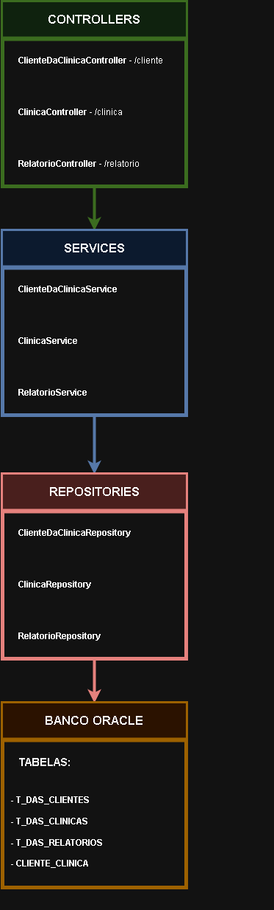
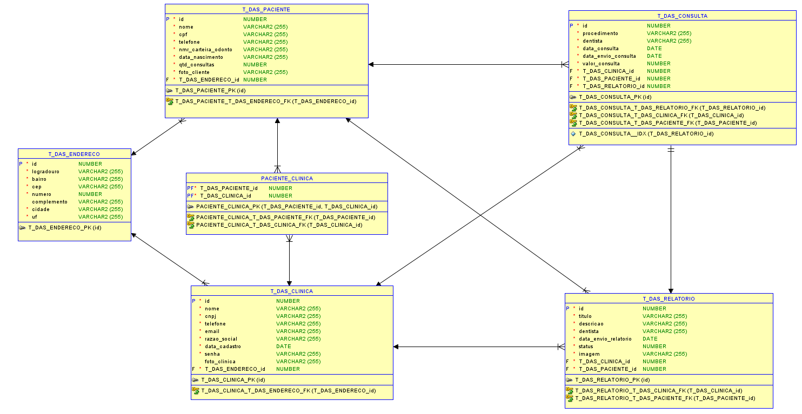
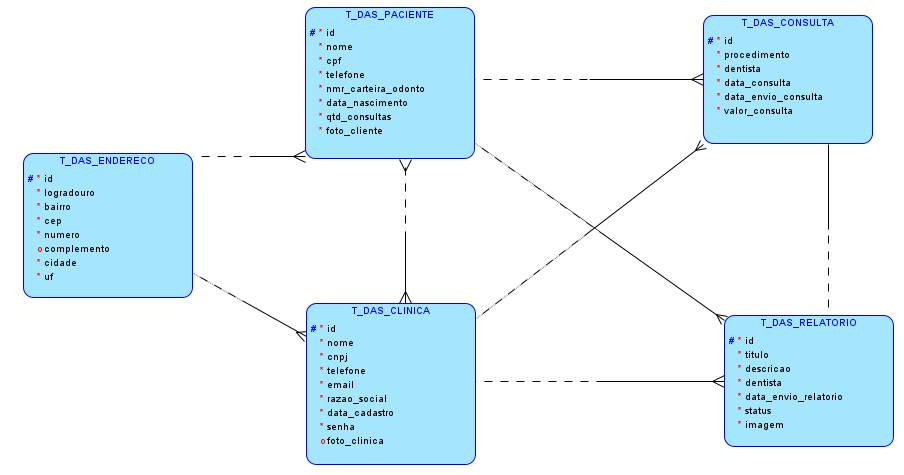
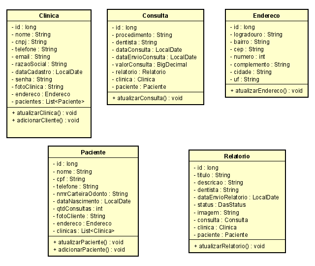

# Dental Analytics Safe

## 1. Integrantes 
- RM554012 Gabriel Pescarolli Galiza  
- RM554258 Guilherme Gambarão Baptista

### Descrição do Projeto
Nosso projeto consiste em uma API desenvolvida em Java utilizando o framework Spring Boot para gerenciar clientes e clínicas odontológicas, incluindo a criação e consulta de relatórios de consulta. A API permite a criação, atualização e listagem de clientes e clínicas, além de autenticação de clínicas e gerenciamento de relatórios clínicos.

### Tecnologias Utilizadas
- **Java 17**
- **Spring Boot**
- **JPA / Hibernate**
- **Banco de Dados Oracle**
- **Maven**

## 2. Passos para rodar a aplicação:
1. Clone o repositório:  
git clone https://github.com/GuilhermeAlunoFIAP/Challenger-Sprint-Java.git

2. Abra o diretório do projeto clonado:  
cd Challenge_DAS_JAVA

3. Execute o comando para gerar um .jar da aplicação  
mvn clean package

4. Acesse o diretório target para acessar o .jar  
cd target

5. Rode a aplicação  
java -jar Challenge01-0.0.1-SNAPSHOT.jar 

## 3. Imagem do Diagrama

### 3.1 Imagens:

### 3.2 Breve explicação dos Relacionamentos e Constraints:

#### 3.2.1 Relacionamentos:  
Um cliente pode estar relacionado a vários relatórios, mas cada relatório pertence a apenas um cliente.  
Uma clínica pode estar relacionado a vários relatórios, mas cada relatório pertence a apenas uma clínica.  
Um cliente pode estar relacionado a várias clínicas e uma clínica pode estar relacionada a vários clientes.  

#### 3.2.2 Chaves Estrangeiras:  
cliente_id e clinica_id no relatório referenciam as tabelas Cliente e Clínica, garantindo que um relatório sempre esteja associado a um cliente e a uma clínica.  
Clinica e Cliente possuem uma tabela de junçao com os IDs cliente_id e clinica_id que são chaves estrangeiras que referenciam Cliente e Clínica, respectivamente.  

## 4. Endpoints Disponíveis

### 4.1. Endpoint de Clinica - /clinica
**POST** /clinica - cria uma clínica  
**POST** /clinica/login - login da clínica  
**PUT**  /clinica - atualiza informacoes da clinica  
**GET**  /clinica - lista todas as clinicas  
**GET**  /clinica/cnpj - lista clinica por cnpj

### 4.2. Endpoint de Paciente - /paciente
**POST** /cliente - cria um cliente/paciente  
**PUT** /cliente - atualiza informacoes do cliente/paciente  
**GET** /cliente - lista todos os clientes/pacientes  
**GET** /cliente/cpf - lista um cliente por cpf  

### 4.3. Endpoint de Relatorio - /relatorio
**PUT** /relatorio - atualiza informacoes de um relatorio  
**GET** /relatorio - lista todos os relatorios  
**GET** /relatorio/id - lista um relatorio por id  
**GET** /relatorio/clinica/id - lista os relatorios de uma clinica  
**GET** /relatorio/paciente/id - lista os relatorios de um cliente/paciente  
**DEL** /relatorio/negar/id - nega o pedido de um relatorio  
**DEL** /relatorio/aprovar/id - aprova o pedido de um relatorio  

### 4.4. Endpoint de Consulta - /consulta
**POST** /consulta - cria uma consulta juntamente com um relatorio  
**PUT** /consulta - atualiza informacoes de uma consulta  
**GET** /consulta - lista todas as consultas  
**GET** /consulta/id - lista uma consulta por id  